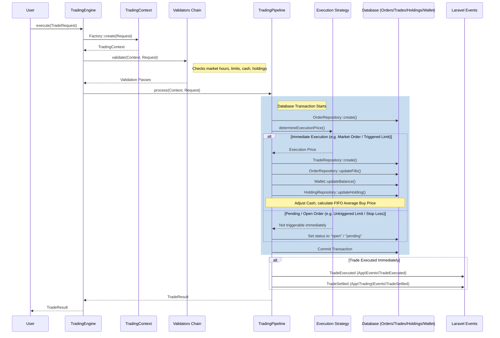

# Trading Engine Subsystem Implementation Report

The **Trading Engine Subsystem** serves as the exclusive component for executing and settling paper trades in Paper Trading Tycoon. It acts as the single gateway for managing orders, order executions, wallet cash updates, and user portfolio holdings. No other module is permitted to manipulate these tables directly, ensuring high transactional integrity, safety limits enforcement, and robust event-driven game metrics syncing.

---

## 1. System Architecture

The trading subsystem is located under `app/Trading/` and structured as follows:

```
app/Trading/
├── Calculators/
│   └── TradeCalculator.php
├── Contexts/
│   └── TradingContext.php
├── Contracts/
│   ├── HoldingRepositoryContract.php
│   ├── OrderExecutionStrategyContract.php
│   ├── OrderRepositoryContract.php
│   ├── TradeRepositoryContract.php
│   └── TradingValidatorContract.php
├── DTOs/
│   ├── TradeRequest.php
│   └── TradeResult.php
├── Enums/
│   ├── OrderStatus.php
│   └── OrderType.php
├── Events/
│   └── TradeSettled.php
├── Factories/
│   └── TradingContextFactory.php
├── Jobs/
│   └── ProcessOpenOrdersJob.php
├── Listeners/
│   ├── HandlePortfolioUpdatedForGame.php
│   └── HandleTradeExecutedForPortfolio.php
├── Pipelines/
│   └── TradingPipeline.php
├── Repositories/
│   ├── HoldingRepository.php
│   ├── OrderRepository.php
│   └── TradeRepository.php
├── Services/
│   └── TradingEngine.php
├── Strategies/
│   ├── BracketOrderStrategy.php
│   ├── LimitOrderStrategy.php
│   ├── MarketOrderStrategy.php
│   ├── OrderStrategyRegistry.php
│   └── StopLossOrderStrategy.php
└── Validators/
    ├── DuplicateOrderValidator.php
    ├── FeatureFlagValidator.php
    ├── InvalidQuantityValidator.php
    ├── InvalidSymbolValidator.php
    ├── MarketOpenValidator.php
    ├── MaxDailyTradesValidator.php
    ├── MaxExposureValidator.php
    ├── MaxPositionsValidator.php
    ├── PremiumFeaturesValidator.php
    ├── SufficientCashValidator.php
    ├── SufficientHoldingsValidator.php
    └── TradingHoursValidator.php
```

### High-Level Components

1. **TradingEngine (Facade)**: The public entry point for creating orders. It initializes the `TradingContext`, routes requests through the validator chain, and delegates execution to the pipeline.
2. **TradingContext & Factory**: Holds pre-loaded, immutable state representing the user, wallet, stock, market price, existing orders, and holdings. This eliminates redundant queries during validation and execution.
3. **Validators Chain**: A series of rules ensuring strict compliance with market availability, portfolio safety, and user tier capabilities before allowing order entry.
4. **Execution Strategies**: Distinct matching and calculation rules for Market, Limit, Stop-Loss, and Bracket orders.
5. **Repositories**: Eloquent adapters encapsulating data operations for orders, trades, and holdings.
6. **Trading Pipeline**: Orchestrates database transactions, executes orders, updates wallet balances and holdings, manages OCO child order cancellations, and dispatches events.
7. **ProcessOpenOrdersJob**: An asynchronous worker that polls open limit/stop/bracket orders, checks quotes, and triggers executions.

---

## 2. Order Execution & Settlement Flow

The life cycle of an order is strictly managed by `TradingPipeline` under a database transaction:



### Event-Driven Portfolio Valuation & Game Syncing
* **`TradeExecuted` Listener (`HandleTradeExecutedForPortfolio`)**: Listens for immediate fills. Computes total portfolio cash and holding values, creates a `portfolio_snapshots` record (`manual` type), and dispatches `PortfolioUpdated`.
* **`PortfolioUpdated` Listener (`HandlePortfolioUpdatedForGame`)**: Captures portfolio value changes, invokes the Game Engine and Reward Engine to recalculate user rankings, league standing, awards XP, coins, and unlocks achievements.

---

## 3. Financial Calculators (FIFO & Fee Structure)

All calculations use strict `bcmath` operations via `TradeCalculator` to prevent floating-point drift:

### FIFO Average Buy Price Calculation
When selling holdings, we do not modify the purchase price of remaining shares. When buying more shares, we compute the average buy price:
$$\text{New Avg Price} = \frac{(\text{Current Qty} \times \text{Current Avg Price}) + (\text{New Qty} \times \text{Execution Price})}{\text{Current Qty} + \text{New Qty}}$$

### Tax & Transaction Fees
* **Transaction Fee**: 0.05% of the total transaction value.
* **Tax (GST)**: 18% of the transaction fee.
* **Brokerage**: Nil (Paper trading).
* **Formula**:
  $$\text{Fee} = \lfloor \text{Value} \times 0.0005 \rfloor$$
  $$\text{Tax} = \lfloor \text{Fee} \times 0.18 \rfloor$$
  $$\text{Total Cost (Buy)} = \text{Value} + \text{Fee} + \text{Tax}$$
  $$\text{Total Proceeds (Sell)} = \text{Value} - (\text{Fee} + \text{Tax})$$

---

## 4. Risk Controls & Safety Limits (Validators)

To ensure game balance and limit abuse, every trade request must pass through the validation pipeline:

| Validator | Target Metric / Rule | Rejection Message |
| :--- | :--- | :--- |
| **MarketOpen** | Market status must be 'open'. | Market is currently closed. |
| **TradingHours** | Must be within NSE hours (09:15 to 15:30 IST, Mon-Fri). | Trading is only allowed during market hours (09:15 - 15:30 IST, Monday to Friday). |
| **SufficientCash** | Buy order cost (Qty * Price + Fees + Tax) <= virtual cash. | Insufficient funds in wallet. |
| **SufficientHoldings** | Sell order quantity <= current holding quantity. | Insufficient stock holdings to execute sell order. |
| **MaxPositions** | Total unique stock holdings <= 15. | Maximum position limit of 15 unique stocks reached. |
| **MaxDailyTrades** | Total orders executed in past 24 hours <= 50. | Daily order execution limit of 50 reached. |
| **MaxExposure** | Margin/cash exposure of single stock <= 20% of total portfolio value. | Order exceeds maximum exposure limit of 20% of portfolio value. |
| **DuplicateOrder** | Prevents rapid identical requests (symbol, side, qty) within 30 seconds. | Duplicate order detected. Please wait 30 seconds. |
| **PremiumFeatures** | Bracket orders (OCO) restricted to premium users. | Bracket orders are a premium feature. |
| **FeatureFlag** | checks if the specific order side/type flag is active. | Feature flag is disabled. |

---

## 5. Verification & Test Plan

Verification consists of automated PHPUnit unit & integration tests, static analysis, and code styling audits.

### Automated Tests
1. **Value Objects (`ValueObjectsTest`)**: Verifies that custom domain types (Quantity, Prices, Tax, Fees) enforce constraints (e.g. non-negative integers).
2. **Trade Calculator (`TradeCalculatorTest`)**: Verifies correctness of FIFO holding updates, average buy price math, GST/fee logic, and net value calculations.
3. **Pipeline & Engine (`TradingEngineTest`)**: High-fidelity integration test simulating:
   * Execution of immediate market orders.
   * Enforcing insufficient balance limits.
   * Tracking open limit / stop orders.
   * Auto-cancelling OCO bracket child legs on single-fill.
   * Background matcher triggers under Carbon simulated trading times.

All tests execute successfully:
```bash
vendor/bin/phpunit
```

### Static Analysis & Linting
* **PHPStan**: Passes Level 8 checks cleanly with zero type errors.
* **Laravel Pint**: Configured and formatting verified.
